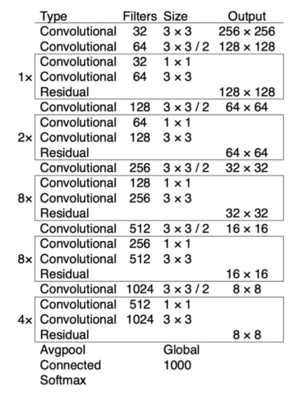

# Mission



1. 위 테이블의 예시를 보고 해당하는 스펙에 맞게 모델 직접 구현해보세요. 그리고 현재 우리 문제 정의에 맞게 Classifier도 설계해보세요.

Input Image 의 Shape 은 (3, 256, 256) 이라고 생각하고 진행하겠다.

> 참고 Convolution layer 의 output size 계

- 각각 기호를 아래와 같이 정의
  - $O$: Size(width) of output image
  - $I$: Size(width) of input image
  - $K$: Size(width) of kernels used in the Conv layer
  - $N$: Number of kernels
  - $S$: Stride of the convolution operation
  - $P$: Padding size
- $O$(Size(width) of output image)는 다음과 같이 정의 됨


첫번 째 Convolutional layer 를 지날 때 filter 의 개수가 32개로 늘어나고 kernel_size 는 (3, 3) 이고 
Output 의 shape 은 (32, 256, 256) 이 나와야 한다.

```python
nn.Conv2d(in_channels=3, out_channels=32, kernel_size=3, stride=1, padding=1)
```

두번 째 Convolutional layer 를 지날 때 filter 의 개수가 64개로 늘어나고 kernel_size 는 (3, 3) 이고 Stride 는 2를 주고
결과 Output 의 shape 은 (64, 128, 128) 이 된다.

```python
nn.Conv2d(in_channels=32, out_channels=64, kernel_size=3, stride=2, padding=1)
```


